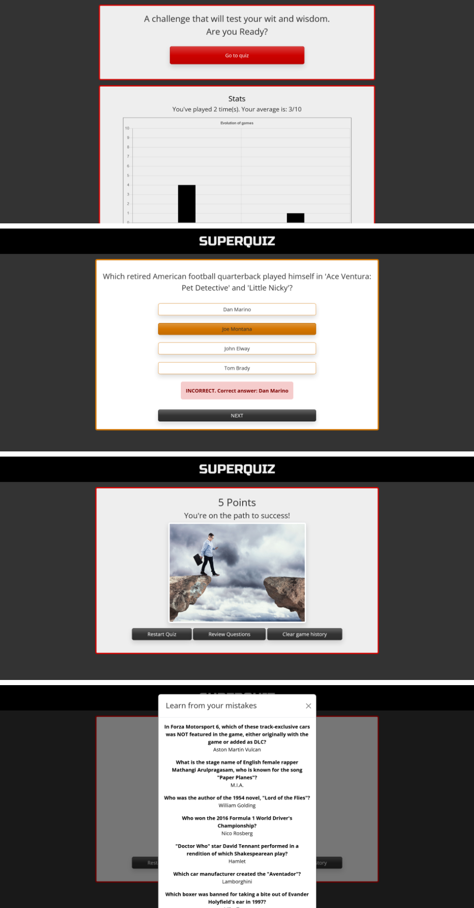
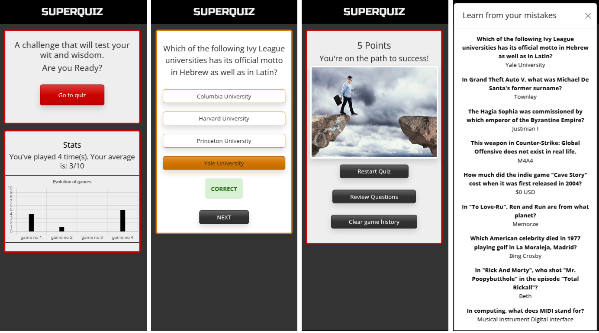

# QUIZ GAME PROJECT 🃏

**INDEX**

- [QUIZ GAME PROJECT](#quiz-game-project-)
    - [Brief intro](#brief-intro-)
    - [Milestones](#milestones-)
    - [Future upgrades](#future-upgrades-)
    - [HTML notes](#html-notes-)
    - [JS notes](#javascript-notes-)
    - [CSS notes](#css-notes-)
    - [AXIOS notes](#axios-notes-)
    - [Built with (Toolset)](#built-with-toolset-)
    - [Authors](#autors-)
    - [License & copyrignt](#license--copyright-)
    - [Acknowledgement](#acknowledgement-)

- [QUIZ INSIDES](#quiz-insides)
    - [Quiz description](#quiz-description-)
    - [Game rules](#game-rules-)
    - [Game views(pages)](#game-viewspages-)
    - [Fun scoring](#fun-scoring-)
    - [Play & learn!](#play--learn-)
    - [Screenshots](#screenshots)


- [CODING THE QUIZ](#coding-the-quiz-)
    - [DOM to JS](#dom-to-js-)
        - [Buttons](#buttons-)
        - [Sections](#sections-)
        - [Div's](#divs-)
    - [Variables for global scope](#variables-for-global-scope-)
    - [Functions](#functions-)
        - [Show views](#show-views-)
        - [Start game](#start-game-)
        - [Show question & answers buttons](#show-question--answers-buttons-)
        - [Select answers & show messages](#select-answers--show-messages-)
        - [Reset answers](#reset-answers-)
        - [Show results](#show-results-)
        - [Quiz Q&A report for study](#quiz-qa-report-for-study-)
        - [Save results (JSON)](#save-results-json-)
        - [Clear results (JSON)](#clear-results-json-)
        - [Chart](#chart-display-and-creation-(chart.js))
        - [Restart Quiz](#restart-quiz)
    - [Add event listeners for buttons](#add-event-listeners-for-buttons-)
    - [Onload functions](#functions-called-on-first-page-load)
***

## Brief intro 📅
[⬆️](#quiz-game-project-)
>*This project aims to implement promises & SPA (Single Page Application) through a Quiz Game.*

***

> __Note__
Project managers have introduced in the briefing document some suggestions to include extra features, which have been detailed in the table below.


## Milestones 📅
[⬆️](#quiz-game-project-)
>*Main milestones to reach in the project are;*

| HTML JS CSS     | Milestone |
| :-----------:   | :---------- |
|JS               | To import data from an external API       |
|(All)            | Create the Quiz code to convert the imported data into a working Quiz game       |
|JS               | Create counters and score for players 
|JS               | Develop a SPA model that allows users to browse the three main pages under the Quiz game| 
|JS               | Save the results in Local Storage and retrieve it to display  game stats                |
|JS               | Create game controls and game interaction through buttons  |

> __Note__
Coding priorities have been re-checked almost daily in order to speed up project development.


## Future upgrades ✅
[⬆️](#quiz-game-project-)
>Things to do
>- [x] Improve score section to show funny answers based on scoring
>- [x] Add images to the score to improve impact 
>- [X] Add score chart in main view
>- [X] Add title animation on header
>- [ ] Multiplayer option
>- [ ] On start, select difficulty level (radio buttons)
>- [ ] On start, select topic (collapsible list)
>- [ ] On start, select number of questions (radio buttons)
>- [ ] Layout color scheme change option (radio buttons)


## HTML notes 📋
[⬆️](#quiz-game-project-)
>We've build up the HTML with Bootstrap in mind.
It means that we've created a nested div structure that allows us to style each section to better define each single page view.
>With DOM access in mind to accomplish call-request functions.
>HTML structure has been kepts as simple as possible for quick and safe testing.

## JavaScript notes 📋
[⬆️](#quiz-game-project-)
>Script file has been linked inside the `<body>` section.
>We've followed the best practices guidelines during the coding procedure.
>Code has been built in this order:
    >- Variables declarations for:
        - Buttons
        - Sections
        - Divs 
        - Variables for global scope
    >- Functions:
        - Show views
        - Start game
        - Show question & answers buttons
        - Select answers & show messages
        - Reset answers
        - Show results
        - Quiz Q&A report for study
        - Save results (Local Storage)
        - Clear results (Local Storage)
        - Retrieve results (Local Storage)
        - Create chart view of results
        - Restart
    >- Event listeners for buttons
    >- Functions that are called on initiation <br>
> 
>__Note__
To create and display the chart, we've used **chart.js** , which needs to be inserted as script in html and built with a js function.

## CSS notes 📋
[⬆️](#quiz-game-project-)
>CSS files have been linked inside the `<head>` section.
>Our own CSS styles file only contains the main rule which manages the visibility of the views and animation for the header. Nothing else is brought from this file.
>We've used a Bootswatch template to create the visual setup, following the style and syntax of BOOTSTRAP.

>There are three views within the site:
    -Home: where two cards are shown:
        - Access to Quiz 
        - Score statistics 
    -Quiz: where the game canvas is shown, and the game is played.
    -Score: where the player sees the game score.
>
> __Note__
To show and teach the gamers the right results and allow them to learn and improve their skills, a POPUP window (Bootstrap modal) is used instead of a new view. Thats why the project manages three views instead of four.

>The quiz is responsive thanks to flex and bootstrap grid, changing width at 720px. 

## AXIOS notes 📋
[⬆️](#quiz-game-project-)

>Script file has been linked inside the `<body>` section, after the BOOTSTRAP's js link and before the main .js file.
>Once AXIOS has been linked, we can use it to communicate with the API from which we import the quiz questions as PROMISES using the CRUD paradigm.


## Built with (TOOLSET) ⚙️
[⬆️](#quiz-game-project-)

*VISUAL STUDIO CODE*

>* [*VISUAL STUDIO CODE*](https://code.visualstudio.com/) - Code editor used (Version: 1.75.1)
>* [*BOOTSTRAP*](https://getbootstrap.com) - CSS Framework (Version: 5.3.0) 
>* [*BOOTSWATCH*](https://bootswatch.com) - CSS Templates for Bootstrap
>* [*Open trivia database*](https://opentdb.com/) - API for questions
>* [*Live Server*](https://marketplace.visualstudio.com/items?itemName=ritwickdey.LiveServer) -Extension that updates the choosen browser to see changes in real time.
>* [*Live Share*](https://marketplace.visualstudio.com/items?itemName=MS-vsliveshare.vsliveshare) -Extension that allow remote team coding under the same Visual Studio project  (Version: 1.0.5832). 

## Authors ✒️
[⬆️](#quiz-game-project-)

**kbastamow** - *Concept* | *Design* | *Coding*- [kbastamow](https://github.com/kbastamow)

**Joan Baldó** - *Concept* | *Design* | *Coding*- [joanbaldo](https://github.com/joanbaldo)

## License & Copyright 🔏 
[⬆️](#quiz-game-project-)

>Please feel free to use our code if it can help you! 
>Images shown have their own rights and have been used to reinforce positively the game score results view. All of them aim to inspire and bring enthusiasm to those gamers who are brave enough to face our Quiz challenge.
>Regarding JS code, please check [LICENSE.md] for details.

## Acknowledgement 🫶
[⬆️](#quiz-game-project-)

* Sofia Pinilla as code adviser and good vibe manufacturer.
* Federico Arévalo as spiritual coach
* The crazy guys that are on our side creating amazing stuff while giving us a hand

***

# QUIZ INSIDES🎲
[⬆️](#quiz-game-project-)

>Now let's talk about the game!

## Quiz description 📄
[⬆️](#quiz-game-project-)

>Our Quiz game has the following features:
    - Vast range of topics mixed in a very attractive way
    - 10 random questions per round
    - Player gets real time feedback to know if the chosen answer is correct or incorrect.
    - Final score with funny output.
    - Option of checking all the right answers to learn the questions of the quiz round just played and improve.
    -Possibility or resetting the scoring history of the player.

## Game rules 📜
[⬆️](#quiz-game-project-)

>- Each round contains 10 questions.
>- Player can only choose one of the four answers shown for the question provided.
>- Player has to complete the quiz to be able to get the score.
>- Player has the option of resetting their score history.
>- Player has unlimited chances to play the Quiz. As many rounds as they deserve...


## Game views(pages) 🖲️
[⬆️](#quiz-game-project-)

>There are three views within the site:
    -Home: where two cards are shown:
        - Access to Quiz 
        - Score statistics
    -Quiz: where the game canvas is shown, and game is played.
    -Score: where you get the game score


## Fun scoring 🎯
[⬆️](#quiz-game-project-)

>We want that you enjoy each round!
>Thant's why we've prepared some surprises after each round when the game score is shown... go and try it!

## Play & learn! 🎓
[⬆️](#quiz-game-project-)

>We strongly believe that game and knowledge must coexist, so we've set up an extra function that allows the player to study all the questions and answers from the game round by clicking a button.

## Screenshots
[⬆️](#quiz-game-project-)

>Computer:

>Screens smaller than 720px:



***

# CODING THE QUIZ ⌨️
[⬆️](#quiz-game-project-)

>Warm your fingers...it's coding time!

## DOM to JS 🖳
[⬆️](#quiz-game-project-)

>As the basic task to start coding page view management and building HTML contents, we have to import the basic HTML elements.

### Buttons 🖳
[⬆️](#quiz-game-project-)

>We bring from DOM all the buttons.
```json
const quizBtn = document.getElementById("quizBtn");
const nextBtn = document.getElementById("nextBtn");
const restartBtn = document.getElementById("restartBtn");
const clearBtn = document.getElementById("clearBtn")
const reviewBtn =document.getElementById("reviewBtn")
```

### Sections 🖳
[⬆️](#quiz-game-project-)

>We bring from DOM the sections which contain the main views.
```json
const home = document.getElementById("home");
const quiz = document.getElementById("quiz");
const score = document.getElementById("score");
```

### Div's 🖳
[⬆️](#quiz-game-project-)
>We bring from DOM the secondary containers where we place the elements.
```json
const question = document.getElementById("question");
const answers = document.getElementById("answers")
const counterDiv = document.getElementById("counterDiv");
const sentenceDiv = document.getElementById("sentenceDiv");
const image = document.getElementById("image");
const clearedMsg = document.getElementById("clearedMsg");
const questionsPopup = document.getElementById("questionsPopup");
const chartDiv = document.getElementById("chartDiv")
```

## Variables for global scope 🖳
[⬆️](#quiz-game-project-)
>The following step is to declare the global variables.
>Local variables have been declared inside their functions (local scope).
```json
let quizArray;
let qIndex = 0;
let correctAnswer = "";
let counter = 0;
let scoreArray = [];
```
## Functions 🖳
[⬆️](#quiz-game-project-)
>These are some of the functions coded in JS.

### Show views 🖳
[⬆️](#quiz-game-project-)
>Function aimed to show/hide the views elements.
>Original functions have been upgraded to reduce the code.
```json
function reveal(page) {
  home.classList.add("hide");
  quiz.classList.add("hide");
  score.classList.add("hide");
  page.classList.remove("hide");
}
```
### Start game 🖳
[⬆️](#quiz-game-project-)
>Function aimed to start the Quiz when pressing the button.
```json
async function startQuiz(e) {
  e.preventDefault();
  try {
    const res = await axios.get("https://opentdb.com/api.php?amount=10&type=multiple");
    quizArray = res.data.results;
    showQuestion(e) 
  } catch (error) {
      console.error(error) 
    }
}
```
### Show question & answers buttons 🖳
[⬆️](#quiz-game-project-)
>Function aimed to render the question and the answers array.
```json
function showQuestion(e) {
  e.preventDefault();
  reveal(quiz);
  resetState();
  nextBtn.classList.remove("hide");
  nextBtn.setAttribute("disabled", "true");
  question.innerHTML = quizArray[qIndex].question;
  correctAnswer = quizArray[qIndex].correct_answer;
  const options = [...quizArray[qIndex].incorrect_answers, correctAnswer].sort();
    options.forEach((option) => {
    const button = document.createElement("button");
    button.setAttribute("class","btn btn-outline-warning border-2 rounded-0 text-dark shadow");
    button.innerHTML = option;
    if (option == correctAnswer) {
    button.classList.add("correct");
    }
    button.addEventListener("click", selectAnswer);
    answers.appendChild(button);
  });
  qIndex += 1;
}
```
### Select answers & show messages 🖳
[⬆️](#quiz-game-project-)
>Function aimed to render answer status: correct or incorrect.
```json
function selectAnswer(e) {
  e.preventDefault();
  nextBtn.removeAttribute("disabled");
  document.querySelectorAll("#answers button").forEach((button => button.removeEventListener("click", selectAnswer))); 
  const selectedStyle = this.getAttribute("class").replace("btn-outline-warning", "btn-warning");
  this.setAttribute("class", selectedStyle);
  if(this.classList.contains("correct")) {
   let msg = document.createElement("div");
   msg.innerHTML = `<p class="alert alert-success border-0 fw-bold">CORRECT</p>` 
   answers.appendChild(msg);
     counter +=1 ;
  } else {
   let msg = document.createElement("div");
   msg.innerHTML = `<p class="alert alert-danger border-0 fw-bold"><span class="fw-bold">INCORRECT.</span> Correct answer: ${correctAnswer}</p>` 
   answers.appendChild(msg);
  }

  if (quizArray.length == qIndex)  {    
   nextBtn.classList.add("hide");
   const resultBtn = document.createElement("button");
   resultBtn.setAttribute("class", "btn btn-dark shadow my-2 px-5")
   resultBtn.innerHTML = "See your score";
   resultBtn.addEventListener("click", results);
   answers.appendChild(resultBtn); 
 } 
}
```
### Reset answers 🖳
[⬆️](#quiz-game-project-)
>Function aimed to reset the questions canvas,cleaning it.
```json
function resetState() {
  while (answers.firstChild) {
    answers.removeChild(answers.firstChild);
  }
}
```
### Show results 🖳
[⬆️](#quiz-game-project-)
>Function aimed to render the score and add a funny sentence and an image.
```json
function results(e) {
  e.preventDefault();
  saveScore(); 
  reveal(score);
  counterDiv.innerHTML = `${counter} Points`;
  if (counter <= 3) {
    image.setAttribute("src", "https://upload.wikimedia.org/wikipedia/commons/thumb/4/4b/McDonald%27s_logo.svg/220px-McDonald%27s_logo.svg.png")
    sentenceDiv.innerHTML = `You better look for a job at McDonalds!`;
  } else if (counter > 3 && counter <= 5) {
    image.setAttribute("src", "https://media.istockphoto.com/id/1186712099/photo/walking-into-the-abyss-while-using-smartphone.jpg?s=170667a&w=0&k=20&c=-I2on4piBRgMXFPLHRxZKv5TLUNKT3_lyxKsYaZR9kg=")
    sentenceDiv.innerHTML = `You're on the path to success!`;
  } else if (counter > 5 && counter <= 7) {
    image.setAttribute("src", "https://imageio.forbes.com/specials-images/imageserve/5bb22ae84bbe6f67d2e82e05/0x0.jpg?format=jpg&crop=1012,1013,x627,y129,safe&height=416&width=416&fit=bounds")
    sentenceDiv.innerHTML = `You're on your way to becoming the next Bezos`;
  } else if (counter > 7 && counter <= 9) {
    image.setAttribute("src", "https://jingdaily.com/wp-content/uploads/2013/10/Screen-Shot-2013-10-09-at-2.54.19-AM.jpg")
    sentenceDiv.innerHTML = `Your insane points will bring you your dreamed yacht, supercar & private resort in Ibiza`;
  } else {
    image.setAttribute("src", "https://t3.ftcdn.net/jpg/05/64/37/30/360_F_564373014_pREjFn0SL1hd1TwRAcFfiQqNvD2RmhnT.jpg")
    sentenceDiv.innerHTML = `Will your points let you into Valhalla? Yes!`
  }
}
```
### Quiz Q&A report for study 🖳
[⬆️](#quiz-game-project-)
>Function that shows a popup containing the 10 question with the 10 correct answers.
```json
function studyQs() {
  quizArray.forEach(item => {
    const question = document.createElement("div");
    questionsPopup.appendChild(question);
    question.innerHTML += `<p class="fw-bold mb-0">${item.question}</p>
                           <p>${item.correct_answer}</p>`
  })
}
```
### Save results (JSON) 🖳
[⬆️](#quiz-game-project-)
>Function that sends score to Local Scorage.
```json
function saveScore() {
  const scoreArray = JSON.parse(localStorage.getItem("scores")) || [];
  scoreArray.push(counter);
  localStorage.setItem("scores", JSON.stringify(scoreArray));
  average.innerHTML = `You've played ${scoreArray.length} time(s). Your average is:  ${Number(scoreArray.reduce((acc, val) => (acc + val)) / scoreArray.length).toFixed(0)}/10`;
}
```
### Clear results (JSON) 🖳
[⬆️](#quiz-game-project-)
>Function that cleans the Local Storage.
```json
function clearStorage() {
  if (clearBtn.classList.contains("clickedOnce")){         
    localStorage.clear();
    clearBtn.classList.remove("clickedOnce");
    clearBtn.innerHTML = "Clear game history"
    clearedMsg.innerHTML = `<p class="text-danger fw-bold">Evidence destroyed</p>`
    setTimeout(()=> clearedMsg.innerHTML = "", 4000);    
  } else {        
    clearBtn.classList.add("clickedOnce");  
    clearBtn.innerHTML = "ARE YOU SURE?";
  }
}
```
### Chart display and creation (chart.js) 🖳
[⬆️](#quiz-game-project-) 
>Function that displays chart created with chart.js
```json
function showStats() {
  scoreArray = JSON.parse(localStorage.getItem("scores")) || [];
  if(scoreArray.length == 0) {
    average.innerHTML = "No game history";
  }else {
    average.innerHTML = `You've played ${scoreArray.length} time(s). Your average is:  ${Number(scoreArray.reduce((acc, val) => (acc + val)) / scoreArray.length).toFixed(0)}/10`;
    chartDiv.innerHTML = `<canvas id="chart"></canvas>`;
    createChart();
  }
  }

  function createChart () {
    let xValues = scoreArray.map((game,index) => "game no " + (index + 1));
    let yValues = scoreArray.map(game => game);
    const barColors = "black";
    new Chart("chart", {
      type: "bar",
      data: {
        labels: xValues,
        datasets: [{
          backgroundColor: barColors,
          data: yValues,
          barPercentage: 0.2
        }]
      },
      options: {
        legend: {display: false},
        title: {
          display: true,
          text: "Evolution of games"
        },
        scales: {
          yAxes: [{
            ticks: {
              min: 0,
              max: 10
            }
          }]
        }
      }
    });
    }
```
### Restart Quiz 🖳
[⬆️](#quiz-game-project-)
>Function that resets the quiz and takes player back to page 1.
```json
function restartQuiz(e) {
  e.preventDefault();
  questionsPopup.innerHTML = "";
  qIndex = 0;
  counter = 0;
  image.setAttribute("src", "");
  showStats(); 
  reveal(home);
}
```

## Add event listeners for buttons 🖳
[⬆️](#quiz-game-project-)
>Function that shows which function each button triggers.
```json
nextBtn.addEventListener("click", showQuestion);
restartBtn.addEventListener("click", restartQuiz);
quizBtn.addEventListener("click", startQuiz);   
clearBtn.addEventListener("click", clearStorage); 
reviewBtn.addEventListener("click", studyQs);
```

## Functions called on first page load 🖳
[⬆️](#quiz-game-project-)
> Loads first page.
```json
reveal(home);
showStats(); 
```